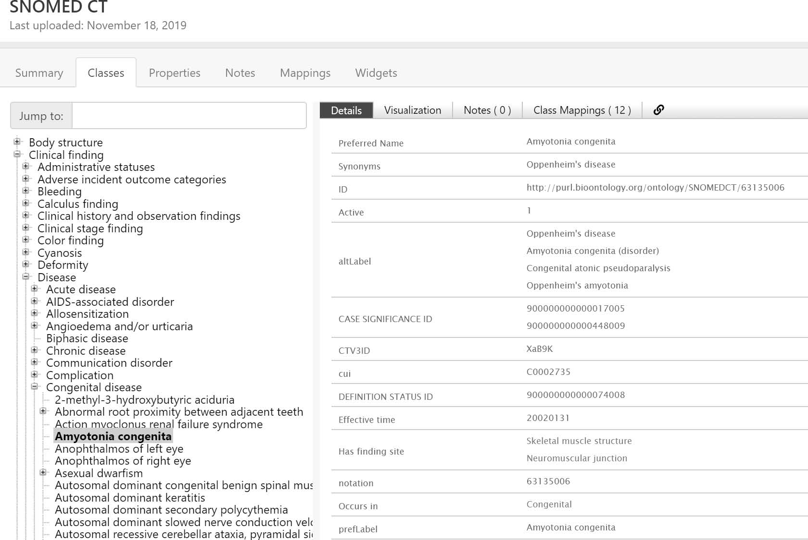
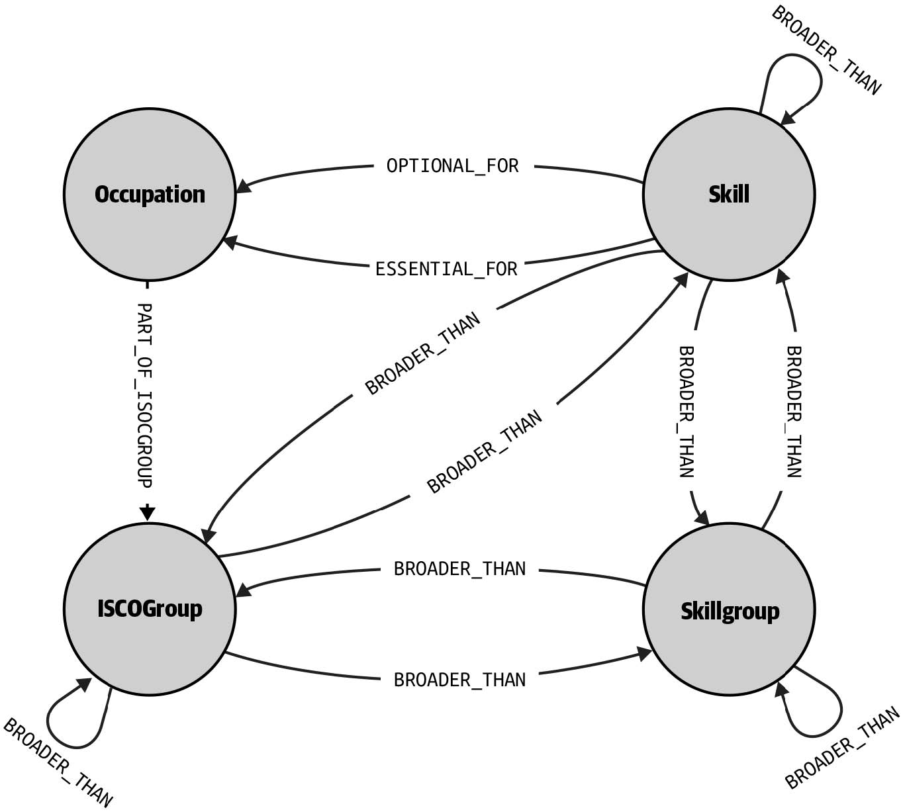

# 第一章 警惕语义鸿沟

> 我们赞成与否，有时基于误解。
> —Mokokoma Mokhonoana
> Our agreement or disagreement is at times based on a misunderstanding.

当前大数据和人工智能狂潮的时代，数据被视为需待机构和企业勘探开采的金矿。无论对这种采金冠以何种名称，数据科学、数据分析、还是商业智能等等，我们能切实看到的是，与数据相关的投资显著增长，对数据工程师、分析师和科研人员等专业人士的需求与日俱增。
In the era of the big data and AI frenzy, data is considered a gold mine that awaits organizations and businesses that will find and extract their gold. Whether you call this data science, data analytics, business intelligence, or something else, you can’t deny that data-related investments have increased significantly, and the demand for data professionals (engineers, analysts, scientists, etc.) has skyrocketed.

这些专业人士是否能采到金子？并非总是如此。有时机构宣称自己拥有的数据是片大海，但事实上充其量是个小池塘。有时数据的确存在，但是其中并不含有金子，亦或是所含的金子并不适用于机构。还有一种常见的情况，数据和金子的确存在，但提炼金子的架构或技术尚不具备，或是不够成熟。数据专业人士即便诸事俱备，即大量的数据、可开采的金子，以及最先进的技术，但是依然会产生失败。这是为什么？原因在于，数据提供和数据利用（exploitation）之间存在着语义鸿沟。
Do these professionals manage to find gold? Well, not always. Sometimes, the large ocean of data that an organization claims to have proves to be a small pond. Other times, the data is there but it contains no gold, or at least not the kind of gold that the organization can use. Often it is also the case that both data and gold are there, but the infrastructure or technology needed for the gold’s extraction are not yet available or mature enough. But it can also be that data professionals have all they wish (abundance of the right data, gold to be found, and state-of-the-art technology) and still fail. The reason? The semantic gap between the data supply and the data exploitation side.

下面稍做解释。作为数据从业者，有部分人主要从事数据提供方面的工作，包括收集并生成数据，实现数据的表示、集成、存储，建立可访问的数据模型，提供可用于分析的数据。另有部分人主要从事数据利用方面的工作，包括使用数据建立预测、描述或其他类型的分析解决方案，构建并赋能人工智能应用。一些人会同时从事上述两方面的工作。所有人的共同使命，就是从数据中创造价值。
Let me explain. As data practitioners, many of us work mainly on the data supply side: we collect and generate data, we represent, integrate, store, and make it accessible through data models, and we get it ready for usage and exploitation. Others of us work mainly on the data exploitation side: we use data to build predictive, descriptive, or other types of analytics solutions, as well as build and power AI applications. And many of us wear both hats. We all have the same mission, though: to derive value from data.

但要实现价值创造，常常受困于一个问题，就是本书介绍的语义鸿沟。问题源自于数据使用方误解或滥用了提供方的数据模型，或是提供方误解了使用方的数据需求。这两种情况的出现，是由于不充分或是存在问题的数据语义建模所致。本书将分别从使用方和提供方的角度出发，为语义数据模型的建立提供实践帮助，尽量缩小甚至消除语义鸿沟。
This mission is often compromised by what I like to call the semantic gap—the situation that arises when the data models of the supply side are misunderstood and misused by the exploitation side, and/or when the data requirements of the exploitation side are misunderstood by the supply side. In both cases, the problem is caused by insufficient or problematic modeling of the data’s semantics. This book is about helping practitioners of both sides work better with semantic data models and narrow (if not close) the semantic gap.

## 1.1语义数据建模的定义
What Is Semantic Data Modeling?

语义学研究语言的意义（meaning），研究对象是词、短语和符号等人类与世界交互的指示符间的关系，以及这些指示符在现实世界中的指代，例如实体（entity）、概念（concept）和观念（idea）等。语义学的目标，是对事物（thing）建立统一的认识，使得具有不同经历和观点的人之间能达成互相理解。
Semantics is the study of meaning, concerned with the relationship between signifiers that people use when interacting with the world (words, phrases, signs, and symbols), and the things in that world that these signifiers denote (entities, concepts, ideas). The goal is the creation of a common understanding of the meaning of things, helping people understand each other despite different experiences or points of view.

在计算机科学领域，应用语义有助于计算机系统更准确地理解人类的表述，理解所生成数据的含义。同时，语义有助于在各独立的计算机系统之间建立更高效和有效的交互接口。
When applied in computer science, semantics helps computer systems interpret more accurately what people and the data they produce mean, as well as interface more efficiently and productively with other disparate computer systems.

从这个意义上讲，语义数据建模可定义为建立数据的描述和表示，实现意义的外显（explicit）和正确性，并被计算机和人类普遍理解。上述定义中涵盖了多种数据工件，包括元数据模式、受控词汇表（controlled vocabulary）、分类学、本体、知识图谱、实体-关系（entity-relationship，ER）模型、属性图，以及表示数据的其他概念模型。
In that sense, semantic data modeling can be defined as the development of descriptions and representations of data in such a way that the latter’s meaning is explicit, accurate, and commonly understood by both humans and computer systems. This definition encompasses a wide range of data artifacts, including metadata schemas, controlled vocabularies, taxonomies, ontologies, knowledge graphs, entity-relationship (E-R) models, property graphs, and other conceptual models for data representation.

下面给出两个例子。图1-1展示了系统化临床医学术语命名（Systematized Nomenclature of Medicine -- Clinical Terms，SNOMED CT）标准本体的部分列表。SNOMED CT语义模型针对临床发现、症状、诊断和医疗过程等关键医学术语进行分组、形成概念、给出同义词和定义，并使用层次等关系构建各概念间存在的关联[1]。
As an example, in Figure 1-1 you can see part of the SNOMED CT Standard Ontology, a semantic model that describes the meaning of core medical terms (such as clinical findings, symptoms, diagnoses, medical procedures, and others) by grouping them into concepts, providing them with synonyms and definitions, and relating them to each other through hierarchical and other types of relations [1].

 
图1-1 查看SNOMED CT本体
Figure 1-1. View of the SNOMED CT ontology

图1-2给出的是另一个类似的例子。图中显示了欧洲技能、职业能力、从业资格和职位（European Skills, Competences, Qualifications and Occupations，ESCO）分类的部分模式。ESCO是一种多语言语义模型，其中定义了欧盟劳动市场领域的职位、技能、从业资格及相互关系[2]。
Similarly, Figure 1-2 shows (part of) the schema of the European Skills, Competences,
Qualifications and Occupations (ESCO) classification, a multilingual semantic
model that defines and interrelates concepts about occupations, skills, and qualifications,
for the European Union labor market domain [2].

 
图1-2 ESCO分类模式
Figure 1-2. ESCO classification schema

定义必要且充分的标准，使数据模型提供清晰的语义，这通常并非易事。对此数据社区已开展过数轮辩论[3] [4]。清晰定义特定类型语义数据模型的确切本质和明确特征，例如什么是知识图谱、什么是本体，二者存在那些差别，同样并非易事，并充斥着争议[5] [6]。
In general, defining the necessary and sufficient criteria for a data model to be semantic in a clear way is not a straightforward task, and there are several debates within the data community about this [3] [4]. It can be similarly difficult and controversial to clearly define the exact nature and defining characteristics of particular types of semantic data models (e.g., what exactly is a knowledge graph, what is an ontology, and what are their differences) [5] [6].

本书并不想介入此类争议中，而是使用“语义模型”这一术语，指代所有实现数据意义外显并被人类和机器普遍理解的数据表示形式，着重介绍实现这一目标中存在的挑战性问题。
In this book I am not going to engage in such debates. Instead, I will use the term semantic model to refer to any representation of data whose goal is to make the meaning of data explicit and commonly understood among humans and machines, and focus on the challenge of achieving this goal.

本书并不认为语义模型是一种机器学习模型，因为机器学习的目标并非实现意义的外显。语义模型由表示知识和推理行为的符号组成，而机器学习模型是由亚符号（sub-symbolic）层面的隐藏表征（latent representation）组成，其中不包含人类的任何解释。机器学习模型的长处在于获取统计上显著的规律性和相似性，而语义模型的长处在于获取离散的事实、准确定义并记录。例如，机器学习模型可通过学习典型特征而区分猫和狗，但不会顺藤摸瓜地给出莱卡是一只曾进入过太空的前苏联宇航狗。
What I won’t consider as semantic models, at least for the purposes of this book, are machine learning models, and the reason is that their goal is not the explicitness of meaning. Semantic models consist of symbolic representations of knowledge and reasoning behavior, while machine learning models consist of latent representations at the sub-symbolic level that do not have any obvious human interpretation. The latter excel at capturing knowledge that is not crisp (e.g., statistical regularities and similarities)， while the former capture discrete facts and record precise identities. For example, a machine learning model might learn the typical features that can separate a cat from a dog, but would not be able to keep track of the fact that Leika was a Soviet dog that went into space.

这并不意味着，语义建模在操作数据上比机器学习存在固有的优劣，而是说二者是不同的方法。正是由于存在着差异，二者在人工智能和数据科学中可相得益彰，而非互相竞争。
This does not mean that semantic modeling is an inherently better or worse approach to working with data than machine learning; it merely means that the two approaches are different. And it’s exactly because of these differences that they should be seen as complementary approaches for AI and data science rather than competing ones.

机器学习有助于开发自动化的语义模型，而语义建模有助于加速和提升机器学习模型开发。本书侧重于介绍语义建模，同时也面向语义建模者介绍如何利用好机器学习的方法和工具，面向机器学习实践者介绍如何利用好语义模型，以及如何很好地结合二者。
Machine learning can help automate the development of semantic models, and semantic modeling can help accelerate and enhance the development of machine learning models. And while this book is primarily about semantic modeling, it explores and supports this synergy by showing semantic modelers how to make good use of machine learning methods and tools, and machine learning practitioners how to make good use of semantic models.

## 1.2为什么需要构建语义模型
在语义模型数十年的发展中，出现了本体、知识图谱等多种类型。近期语义模型尤其备受关注，可归因于谷歌在2012年宣称他们的“知识图谱支持对事物而非仅是字符串的搜索”[7]，以及Gartner将知识图谱纳入了2018年新兴技术的技术成熟度曲线（Hype Cycle）[8]。不仅是谷歌，当前包括亚马逊[9]、领英[10]、汤森路透[11]、BBC和IBM[12]等著名机构都已在其产品和服务中使用了语义数据模型。
Ontologies, knowledge graphs, and other types of semantic models have been around for several decades; their popularity, however, has particularly increased in the last few years, with Google announcing in 2012 that “their knowledge graph allowed searching for things, not strings” [7] and Gartner including knowledge graphs in its 2018 hype cycle for emerging technologies [8].  Currently, apart from Google, many prominent organizations like Amazon [9], LinkedIn [10], Thomson Reuters [11], BBC, and IBM [12] are developing and using semantic data models within their products and services.

机构愿意投资语义数据模型，一个原因是希望提高自身的人工智能和数据科学应用与服务能力。当前，尽管不少的应用已基于机器学习和统计方法，但对于应用中的部分任务而言，访问外显符号知识依然是十分必要和有益的。
One reason why an organization would want to invest in a semantic data model is to enhance the functionality of its AI and data science applications and services. Even though such applications nowadays are (rightly) based on machine learning and statistical techniques, there are several tasks for which having access to explicit symbolic knowledge can be necessary and beneficial.

例如，著名的IBM问答系统Watson在2011年参加了热播的竞答节目《Jeopardy!》，对标人类冠军，最终胜出并囊获100万美元奖金[13]。正如Watson的创造者所说，该系统在查询正确的问题解答时，虽然所运行的大部分证据分析是基于非结构化信息的，但其中部分组件使用了知识库和本体去解决特定的知识和推理挑战[14]。
As an example, consider Watson, IBM’s famous question-answering system that competed in the popular quiz show Jeopardy! in 2011 against human champions, and managed to win the first-place prize of $1 million [13]. As Watson’s creators report, even though the majority of evidence analysis the system performed to find the answer to questions relied on unstructured information, several of its components used knowledge bases and ontologies to tackle specific knowledge and reasoning challenges [14].

其中的一个挑战是，由于许多竞答题涉及了时空或地理空间关系，Watson需要确定问题的候选答案在时间上是否匹配，或是包含了与问题所表达一致的时空关系。此外，系统需要知道哪些类型是互斥的，排除与提问在类型上不匹配的答案。例如，对于与国家相关的问题，就可排除与人类相关的答案，因为人不可能是一个国家。Watson通过语义数据模型获取此类知识。
One of these challenges was that, because many questions expressed temporal or geospatial
relations, Watson needed to determine whether candidate answers for a given question were temporally compatible with it, or contained the same geospatial relation as the one expressed in the question. Also, in order to rule out candidate answers whose types were incompatible with what the question asked (e.g., ruling out persons when the question asked for countries), the system required to know which types were mutually exclusive (e.g., that a person cannot also be a country). This kind of knowledge was provided to Watson via semantic data models.

机构需要建立语义模型的另一个重要原因，就是对于那些通常是异构的和孤岛化管理的数据，为使数据更易于发现、可互操作并适用于分析等目的，需要实现数据意义的标准化、对齐并提供语境（context）[15]。
Another important reason organizations would want a semantic model is to standardize and align the meaning of typically heterogeneous and managed-in-silos data, provide it with context, and make it more discoverable, interoperable, and usable for analytics and other purposes [15].

例如，汤森路透作为一家新闻和信息服务公司，在2017年发布了自己的知识图谱。该知识图谱中集成了来自各内容分析师、内容合作伙伴和新闻等两万多不同来源的实体，涵盖机构、人员、金融工具、报价、交易等，意在为数据发现和分析服务提供支持，帮助公司客户更快、更可靠地收集所需的数据和信息[16]。
For example, Thomson Reuters, a news and information services company, launched a knowledge graph in 2017 that integrated data about organizations, people, financial instruments, quotes, deals, and other entities, coming from more than 20,000 different sources (content analysts, content partners, and news sources) [16]. The graph’s purpose was to enable data discovery and analytics services that could help the company’s clients assemble the data and information they needed faster and more reliably.

归根结底，如果我们要针对特定的应用场景构建语义数据模型，那么该模型必须能向使用者有效地传达数据意义的相关详情，这些详情对在该场景下有效解释和使用数据是至关重要的。如果无法做到这一点，那么模型完全有可能无法应用，甚至更糟的是被错误地应用，给出不希望的后果。反之，如果我们针对特定的应用场景使用了并非自己开发的语义模型，此时非常重要的一点，就是确保数据的语义的确是该场景所需要的。如果并非如此，也会给出意想之外的后果。下面给出解释。
In all cases, if you are building a semantic data model for a given application scenario, it’s very important that the model effectively conveys to its users those aspects of the data’s meaning that are important for its effective interpretation and usage within that scenario. If that’s not the case, there is a substantial risk that your model will not be used or, even worse, be used in wrong ways and with undesired consequences. Conversely, if for a given application scenario you are using a semantic model that you haven’t yourself developed, it’s very important to ensure that the semantics of its data are the ones your scenario actually needs. If that doesn’t happen, you might also have undesired consequences. Let’s see why.

## 1.3 不好的语义建模 
Bad Semantic Modeling

为解释为什么语义建模会出问题，这里以图1-2给出的ESCO分类为例。ESCO于2017年发布，经欧盟委员会六年的开发，雄心勃勃地期望能为职业、技能、从业资格提供标准化的概念知识，以被数据科学家和软件开发人员用于：
To see how a semantic model can be problematic, let’s take a closer look at the ESCO classification in Figure 1-2. This model was released in 2017 by the European Commission, after six years of development, with the ambition to provide standardized conceptual knowledge about occupations, skills, and qualifications, that could be used by data scientists and software developers for the following purposes:

* 跨多种语言的简历、职位空缺、教育计划等劳动力市场数据，实现一致、标准化、通识化的语义分析；
Semantically analyze labor market data (CVs, job vacancies, educational programs, etc.) in a consistent, standardized, and commonly understood way, across languages.
* 开发能自动匹配求职者与职位提供方的智能软件。
Develop intelligent software that could automatically match job seekers to job providers.

当前，这一雄心已落地为ESCO提供的多个语义“功能”。例如，使用模型提供的知识，可识别并分组所有可能指向同一职位、技能或从业资质的词语，这种共指对于判别存在多种表述形式的同一职位是否有空缺非常有用。同样，模型提供的知识也可用于判定某项技能与给定职业的相关程度，如图1-1中的标识为“essential_for”和“optional_for”的关系。职位教育方可使用上述知识，判定市场上特定职业技能的供需双方之间的差距，进而对课程设置做出相应地调整。表1-1中列出了与三个职业相应的一些关键技能。
Now, ESCO provides several semantic “goodies” to achieve this ambition. For example, it identifies and groups together all terms that may refer to the same occupation, skill, or qualification concept. This is a very useful piece of knowledge because it can be used to identify job vacancies for the same occupation, even if the latter may be expressed in many different ways. Equally useful is the knowledge the model provides about the skills that are most relevant to a given occupation (see essential_for and optional_for relations in Figure 1-2). Such knowledge can be used, for example, by education providers to identify gaps in the demand and supply of particular skills in the market, and update their curricula accordingly. Table 1-1 shows some examples of essential skills for three occupations.

表1-1. ESCO提供职业和基本技能的部分示例

职业 | 基本技能
:------------------|:-----------------------
数据科学家	 | 数据挖掘、数据建模、信息分类、信息抽取、在线分析处理、查询语言、资源描述框架（resource description framework，RDF）查询语言，统计学、可视化展示技术。
知识工程师	| 商业智能、商业处理建模、数据库开发工具、信息抽取、自然语言处理、人工智能基础知识、RDF查询语言、系统开发生命周期、系统理论、任务的算法实现、Web编程。
数据主管	| LDAP、LINQ、MDX、N1QL、SPARQL、XQuery、企业政策、数据库、文档类型、信息保密、查询语言、RDF查询语言。

但上述知识的ESCO建模者陷入了本书将介绍的众多语义建模陷阱之一，即将主观知识表示为客观的，却未充分告知模型使用者其中存在的模糊性。
Now, the modelers of this latter piece of knowledge in ESCO have fallen into one of the many semantic modeling pitfalls I describe in this book, namely presenting subjective knowledge as objective, and not adequately informing the model’s users about vagueness.

稍加解释。哪种技能对某个职业最重要，一百位专业人士会给出一百个不同的答案。更糟糕的是，如果试图实现ESCO那样区分必备技能和可选技能，那么准备好去面对大量的辩论和分歧吧。在你看来，表1-1中有多少项是必备技能？
Here is the problem: If you ask one hundred different professionals which skills are most important for their profession, you will most likely get one hundred different answers. If, even worse, you attempt to distinguish between essential and optional skills, as ESCO does, then you should prepare for a lot of debate and disagreement. Just take a look at Table 1-1 and see how many essential skills you agree with.

问题在于，“专业人士的必备技能”这一概念，在大多数情况下是模棱两可的。即缺乏能准确地区分“必备技能”与“可选技能”的适用标准。鉴于缺少这样的标准，客观地表示适用于所有语境的“essential_for”关系就是一种错误做法，存在导致问题的风险。
The issue is that the notion of essentiality of a skill for a profession is (in the majority of the cases) vague; i.e., it lacks crisp applicability criteria that clearly separate the essential from the nonessential skills. And without such criteria, it’s wrong (and potentially harmful) to present the essential_for relation as objective and valid in all contexts.

假定我们正在开发一个职业咨询软件。输入是用户所期望的职业，例如数据科学家，输出是从事该职业所需获得和强化的技能列表。软件直接使用了ESCO数据，对期望从事知识工程师职业的用户，输出为必须学习网络编程技能。虽然在某些情况下的确如此，但是将此做为普适各种场景的无可争辩的事实，这是否合理？
Imagine, for example, that you are building some career advice software that takes as input someone’s desired profession (e.g., data scientist) and tells them what skills they need to obtain and/or enhance in order to find a job in that profession. For that purpose, you could directly use ESCO’s data and tell your users, for instance, that in order to become knowledge engineers they must learn web programming. This might indeed be the case in some contexts, but do you think presenting it as an indisputable fact applicable in all contexts is a sound practice?

公平说，不只是ESCO，其他许多语义数据模型也存在着同类问题。同样，数据建模人员也很难对语义进行建模，因为人类的语言和感知中充斥着歧义、模糊、不准确性等现象。由此，数据语义的形式化并给出可被普遍接受的表达是一项艰巨的任务。
To be fair to ESCO, similar problems appear in many semantic data models. And to be fair to data modelers, semantic modeling is hard, because human language and perception is full of ambiguity, vagueness, imprecision, and other phenomena, that make the formal and universally accepted representation of data semantics quite a difficult task.

要在实践中构建一个好的语义模型，关键挑战是如何适当权衡语义的表达程度和清晰度，使得用户和应用从中受益的同时，不会产生过多的开发和维护成本。根据我自身的经验，建立数据模型时，软件开发人员和数据工程师倾向于给出并未充分声明的意义，而本体专家、语言学家和领域专家则更倾向于对意义做过度的规范，并在模型使用者根本不关心的语义差别问题上争论不休。语义建模者的工作，是在数据、领域、应用和用户的需求上，适当平衡模型语义的外显性和可共享性。其中存在着称为“陷阱”和“困境”的隐患。
In practice, the key challenge in building a good semantic model is to find the right level of semantic expressiveness and clarity that will be beneficial to its users and applications, without excessive development and maintenance costs. From my experience, software developers and data engineers tend to under-specify meaning when building data models, while ontologists, linguists, and domain experts tend to overspecify it and debate about semantic distinctions for which the model’s users may not care at all. The job of a semantic modeler is to strike the right balance of meaning explicitness and shareability that their data, domains, applications, and users need. This job is threatened by pitfalls and dilemmas.

## 1.4 如何回避陷阱
语义建模中的陷阱，是指模型创建者所做的决策或行为（action），对于数据的语义、模型的需求或其他方面上存在着明显的错误，导致模型在投入使用后出现不良的后果。陷阱也可能是忽视了一些行为而导致，这些行为是避免出现上述问题所必须的。后者出现的可能性和严重性，视情况而有所不同，但这并非意味着陷阱是无需尽量避免的错误。前面介绍过ESCO并未处理模糊性，乍看起来似乎并不是什么大问题，但不能否认这是一种风险，后果尚待观察。
A pitfall in semantic modeling is a situation in which the model’s creators take a decision or action that is clearly wrong with respect to the data’s semantics, the model’s requirements, or other aspects of the model’s development process, and leads to undesired consequences when the model is put to use. A pitfall can also be the omission of an action that is necessary to avoid such consequences. The latter’s probability or severity may vary, but that doesn’t mean that a pitfall is not a mistake that we should strive to avoid when possible. ESCO’s nontreatment of vagueness that I described earlier may not seem like a big problem at first, but it’s undeniably a risk whose consequences remain to be seen.

建模者落入陷阱，并非完全是由于能力不足或缺乏经验。比我们所认识到的更严重的是，提供语义建模语言、方法学和工具的学术界和工业界都会助纣为虐。问题表现为至少如下三种方式：
Falling into a pitfall is not always a result of the modeler’s incompetence or inexperience. More often than we would like to admit, the academic and industry communities that develop semantic modeling languages, methodologies, and tools, contribute to the problem in at least three ways:

* 在介绍和讲授语义建模时，使用了相互矛盾甚至完全错误的术语；
We use contradictory or even completely wrong terminology when describing and teaching semantic modeling

* 对一些陷阱视若无睹，或是未加重视；
We ignore or dismiss some of the pitfalls as nonexistent or unimportant

* 自身就深陷坑中，还是建立了包含陷阱的技术、文献资料和现实模型。
We fall into these pitfalls ourselves and produce technology, literature, and actual models that contain them

下面内容摘录自两个不同的语义建模资源，从中可一窥实际情况：
To see how this actually happens, consider the following two excerpts from two different semantic modeling resources:

> “……OWL类可解释为包含个体的集合……有时用可用‘概念“替代“类”，类是概念的具体表示……”
“…OWL classes are interpreted as sets that contain individuals… The word concept is sometimes used in place of class. Classes are a concrete representation of concepts…” 

> “一个SKOS概念可视为一个“观念”（idea）或“意念”（notion），是一个“思想”（thought）单元……在叙词表（thesaurus）或分类体系（classification scheme）中的概念，建模为SKOS数据模型中的个体……”
“A [SKOS] concept can be viewed as an idea or notion; a unit of thought…the concepts of a thesaurus or classification scheme are modeled as individuals in the SKOS data model…”

第一段话摘自关于著名的Protégé教程[17]。Protégé支持使用OWL（Ontology Web Language）构建语义模型[18]。第二段话摘录自SKOS规范[19]。SKOS是万维网联盟（W3C）的推荐规范，用于表示叙词表、分类体系、分类法，以及其他类型的结构化受控词表（Controlled vocabulary）。
The first excerpt is found in a popular tutorial about Protégé [17], a tool that enables you to build semantic models according to the Ontology Web Language (OWL) [18]. The second one is derived from the specification of the Simple Knowledge Organization System (SKOS) [19], a World Wide Web Consortium (W3C) recommendation designed for representation of thesauri, classification schemes, taxonomies, and other types of structured controlled vocabularies.

根据上述定义，如何理解语义模型中的“概念“？是Protégé教程所建议的一套事物（thing），还是SKOS声称的某些思想单位？如果需要对存在于OWL中但并非存在于实际事物集合中的概念建模，应该怎么做？是否必须将其作为一个类？在本书随后的章节中可看到，答案是使用SKOS定义将更为准确和有用。正如本书随后介绍的，OWL教程中给出的“概念等价于类”的主张完全是误导性的，会导致一些语义建模上的错误。
Based on these definitions, what do you understand to be a concept in a semantic model? Is it a set of things as the Protégé tutorial suggests, or some unit of thought as SKOS claims? And what should you do if you need to model a concept in OWL that is not really a set of things? Should you still have to make it a class? The answer, as we will see in the rest of the book, is that the SKOS definition is more accurate and useful, and that the “concept = class” claim of the OWL tutorial is at best misleading, causing several semantic modeling errors that we will see later in the book.

无论如何，本书的目标并非就一些不良的语义建模建议而去指责某些人或社区，而是力图引导模型创建者和用户去探索这个并非坦途的空间，介绍如何识别和避免陷阱。
In any case, my goal in this book is not to assign blame to people and communities for bad semantic modeling advice, but to help you navigate this not-so-smooth landscape and show you how to recognize and avoid pitfalls, both as a model creator and user.

## 1.5 如何破解困境
Breaking Dilemmas

不同于陷阱，困境是语义建模中出现的另一种情况。困境指模型创建者必须在不同的行为方式间做出选择，每种方式都有各自的优缺点，并且没有明确的决策过程和标准可用 。
Contrary to a pitfall, a semantic modeling dilemma is a situation in which the model’s creators have to choose between different courses of action, each of which comes with its own pros and cons, and for which there’s no clear decision process and criteria to be applied.

例如，为解决职业和技能二者间模糊的“essential_for”关系，ESCO的开发人员必须拿出一个方案。一种选择是将关系标记为“模糊”以告知用户，但这并不会降低可能发生的潜在分歧。另一个选择是尝试去创建适用于不同语境的不同版本的关系，例如不同的国家、行业和用户组等，以降低潜在分歧的程度。但是这种选择的代价较大，难度更大。那么应如何抉择？
As an example, consider the options that the developers of ESCO have to treat the vague essential_for relation between occupations and skills. One option is to flag the relation as “vague” so that the users know what to expect, but that won’t reduce the potential disagreements that may occur. Another option is to try to create different versions of the relation that are applicable to different contexts (e.g., different countries, industries, user groups, etc.) so that the level of potential disagreement is lower. Doing this, however, is costlier and more difficult. So, what would you advise ESCO to do?

本书将介绍多个关于语义模型的开发和使用的困境。并不会仅仅因为这些困境尚未形成解决方案，就笃定而且“专业”地为读者指定一个。解决语义建模中的困境，需要视其为一个决策问题，通过制定一些可选方案，从中找到一种方法，能从可行性、成本效益、战略或是其它涉及目标和背景的角度对问题做出评估。对此，本书将介绍如何将困境转化为决策问题，并提供为达成决策需查找的信息。
In this book, I will describe several dilemmas related to a semantic model’s development and usage, but I won’t give you a definite and “expert” solution for them simply because there’s no such thing. To tackle a semantic modeling dilemma you need to treat it as a decision-making problem; i.e., you need to formulate the alternative options and find a way to evaluate them from a feasibility, cost-benefit, strategic, or other perspective that makes sense for your goals and context. For that, I will show you how to frame each dilemma as a decision-making problem, and show you what information you should look for in order to reach a decision.

 

## 参考文献

[1] National Center for Biomedical Ontology. “Snomed CT Ontology”. 2019年11月18日最新修订。

[2] European Skills, Competences, Qualifications and Occupations (ESCO). “Occupations”.

[3] AllegroGraph. “Graphs Without Semantics Are Not Enough”. 2018年6月16日最新修订.

[4] Blumauer, Andreas. “Semantic Knowledge Graphs Versus Property Graphs”. Pulse (博客文章), LinkedIn. December 11, 2018.

[5] Cagle, Kurt. “Taxonomies vs. Ontologies”. Forbes. March 24, 2019.

[6] Open Data Science (ODSC). “Where Ontologies End and Knowledge Graphs Begin”. Medium. October 16, 2018.

[7] Singhal, Amit. “Introducing the Knowledge Graph: things, not strings”. The Keyword (博客文章), Google. May 26, 2012.

[8] Panetta, Kasey. “5 Trends Emerge in the Gartner Hype Cycle for Emerging Technologies,2018”. Smarter With Gartner. August 16, 2018.

[9] Amazon. “How Alexa Keeps Getting Smarter”. Day One (blog). October 10, 2018.

[10] He, Qi. “Building The LinkedIn Knowledge Graph”. LinkedIn Engineering (blog). October 6, 2016.

[11] Thomson Reuters. “Thomson Reuters Launches First of Its Kind Knowledge Graph Feed Allowing Financial Services Customers to Accelerate Their AI and Digital Strategies”. Press release, October 23, 2017.

[12] Gao, Yuqing, Anant Narayanan, Alan Patterson, Jamie Taylor, and Anshu Jain. “Enterprise-Scale Knowledge Graphs”. Panel at the International Semantic Web Conference, Monterey, CA, October 2018.

[13] Best, Jo. “IBM Watson: The Inside Story of How the Jeopardy-Winning Supercomputer Was Born, and What It Wants to Do Next”. TechRepublic. September 9, 2013.

[14] Kalyanpur, Aditya, B.K. Boguraev, S. Patwardhan, J.W. Murdock, A. Lally, C.Welty, J.M. Prager, B. Coppola, A. Fokoue-Nkoutche, L. Zhang, Y. Pan, and Z.M. Qiu.“Structured Data and Inference in DeepQA.” IBM Journal of Research and Development 56, no. 3/4 (May/July 2012): 10:1–10:14. https://doi.org/10.1147/JRD.
2012.2188737.

[15] Cagle, Kurt. “The Rise of 360° Semantic Data Hubs”. Forbes. August 16, 2018.

[16] Horrel, Geoffrey. “Intelligent Recommendation Engine for Financial Analysts”.Neo4j (blog). December 7, 2018. Originally presented at GraphConnect New York,October 2017.

[17] Horridge, Matthew. A Practical Guide To Building OWL Ontologies Using Protégé 4 and CO-ODE Tools. University Of Manchester, Manchester, UK, March 24, 2011.

[18] OWL Working Group. “Web Ontology Language (OWL)”. World Wide Web Consortium (W3C). Last modified December 11, 2013.

[19] W3C Working Group. “SKOS Simple Knowledge Organization System Primer”. W3C. August 18, 2009.

